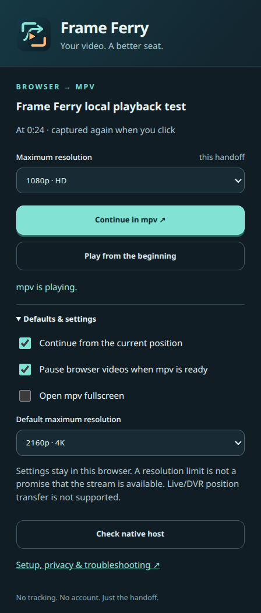

# Frame Ferry


**Send browser videos to mpv. Keep your place.**

Continue from the current position, when available, or start over. Choose a resolution limit and fullscreen playback. Frame Ferry can pause accessible browser videos after mpv confirms playback. If mpv fails to start, the browser keeps playing.

Frame Ferry includes timeline previews, SponsorBlock controls, and YouTube quality recovery. It uses a separate mpv configuration, so your normal player settings stay unchanged.



## Install

Tested on **Linux x86-64 with Helium AppImage**. The installer also has registration paths for Chromium, Chrome, and Brave. The browser must be able to launch Frame Ferry's local Python helper, which runs mpv.

Flatpak/Snap browsers may work with additional host integration, but this installer does not configure or test it. Firefox, Windows, and macOS are not supported.

Install **mpv 0.41+**, **yt-dlp 2026.08+**, **Python 3.10+**, **Deno 2+**, Git, Bash, curl, patch, and diffutils. Then:

```sh
git clone https://github.com/zenworr/frame-ferry.git
cd frame-ferry
./scripts/install-mpv-ui.sh
./scripts/install-mpv-sponsorblock.sh
./scripts/install.sh --browser helium
python3 scripts/doctor --browser helium
```

Replace `helium` with `chromium`, `chrome`, or `brave` as needed.

1. Open your browser's Extensions page, such as `helium://extensions`.
2. Enable **Developer mode** and select **Load unpacked**.
3. Select `~/.local/share/frameferry/extension`, or the path printed by the installer.
4. Pin Frame Ferry, open a video, and select **Continue in mpv**. **Alt+Shift+M** opens the popup.

## Controls

| Control | Action |
| --- | --- |
| Right-click | Pause / resume |
| `F2` | Change the resolution limit |
| `Ctrl+r` | Retry YouTube playback at the current position |
| `Ctrl+b` | Continue YouTube playback in the browser |
| `Alt+q` | Use the fast, lower-quality YouTube fallback |
| `Alt+s` | Toggle sponsor skipping |
| `Ctrl+h` | Change hardware decoding mode |

A 4K limit is not a guarantee of 4K playback. YouTube recovery tries the selected quality before a reduced-quality fallback. Provider restrictions can still prevent playback. Live/DVR position transfer is not supported.

## Update or remove

To update, run `git pull`, rerun the three installer commands above, then **reload the extension**. There are no browser-store updates. The installer preserves local edits.

To remove:

```sh
./scripts/install.sh --uninstall
```

Then remove the extension in your browser. History, logs, backups, and downloaded components are retained; see the [user guide](docs/guide.md#remove-or-restore) for cleanup.

## Privacy and help

The extension has no telemetry. Settings stay local. **Browser-cookie access and automatic yt-dlp updates are off by default.** Media providers and SponsorBlock receive the requests needed for their services. Review playback logs before sharing them.

- [User guide](docs/guide.md): account access, custom browser paths, optional components, and troubleshooting.
- [Development and tests](docs/development.md) · [Contributing](CONTRIBUTING.md) · [Security](SECURITY.md)

Project code and artwork: [MIT](LICENSE). The thumbfast patch and downloaded components have separate licenses; see [third-party notices](THIRD_PARTY.md).
